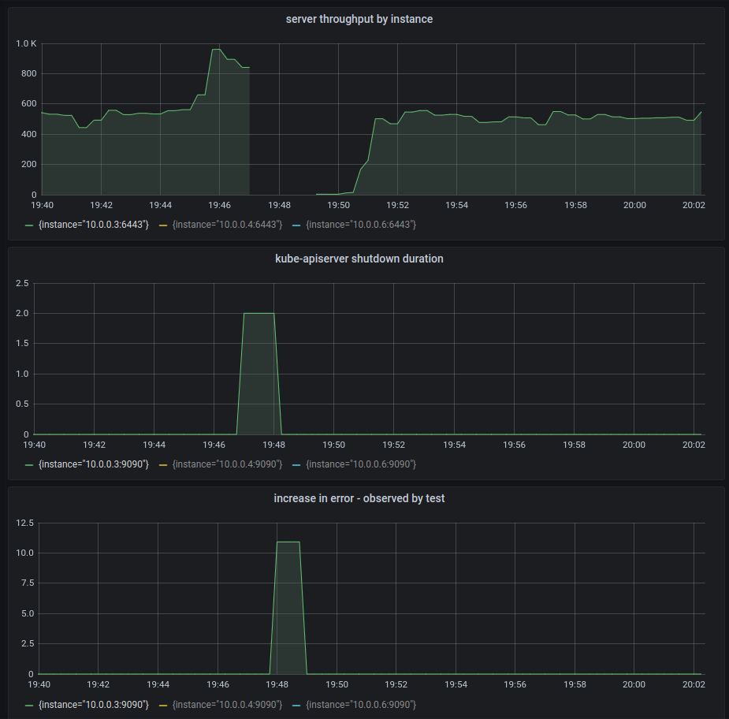

## Background
The control plane component(s) such as `kubelet` uses an internal load balancer to talk to `kube-apiserver`. While 
`kube-apiserver` is rolling out we want to ensure that:
* New connection(s) are accepted within a certain grace period.
* The in-flight connections are given enough time to complete. 
 
Related BZ: https://bugzilla.redhat.com/show_bug.cgi?id=1802534

In GCE we use an `Internal TCP Load Balancer` to route internal traffic to the API server. GCP internal load balancer has the following characteristics:
* It is not `proxy` based.
* A request is always sent to the VM that makes the request, and health check information is ignored. This implies that any request originating from a control plane component on a master node is always routed to the `kube-apiserver` on the same node irrespective of whether `/readyz` reports a failure.

## Objective
We have the following objectives:
* Write a test suite that we can use to reproduce this issue consistently.
* Find a solution to the issue.

## Configuration:
`kube-apiserver` has the following configuration(s) to deal with graceful termination.
* `shutdown-delay-duration` is set to 70s
```bash
kubectl -n openshift-kube-apiserver get cm config -o json | jq -r '.data."config.yaml"' | jq '.apiServerArguments."shutdown-delay-duration"'
[
  "70s"
]
```

* `RequestTimeout` is by default set to `60s`.
https://github.com/kubernetes/kubernetes/blob/master/staging/src/k8s.io/apiserver/pkg/server/config.go#L300

* `terminationGracePeriodSeconds` is set to `135s`.
https://github.com/openshift/cluster-kube-apiserver-operator/blob/master/bindata/v4.1.0/kube-apiserver/pod.yaml#L154
```
terminationGracePeriodSeconds: 135 # bit more than 70s (minimal termination period) + 60s (apiserver graceful termination)
```

* no `preStopHook` defined.


### Test Strategy:
The test will have the following characteristics:
* The test will run inside a `Pod`.
* The test `Pod` will have `hostNetwork` enabled (`hostnetwork: true`) to utilize the host network used by the control
  plane components like kubelet. This ensures that the test avoids kubernetes `Service` network and uses the host's network
  to reach the `kube-apiserver`. 
* We want to use the address of the internal load balancer to reach the `kube-apiserver`. We access the `kubeconfig` 
  used by kubelet on the node and use the `Host` URL. This is always set to the internal load balancer URL.
```yaml
apiVersion: apps/v1
kind: DaemonSet
spec:
  template:
    spec:
      hostNetwork: true
      securityContext:
        runAsUser: 0
      containers:
        - name: graceful-test
          securityContext:
            privileged: true
          command:
            - /usr/bin/graceful-termination-test
            - -kubelet-kubeconfig=/var/lib/kubelet/kubeconfig
          volumeMounts:
          - mountPath: /var/lib/kubelet
            name: kubeconfig
      volumes:
      - name: kubeconfig
        hostPath:
          path: /var/lib/kubelet
```
* The test will run on each master node and will concurrently (10 go routines) issue request(s) to the API server. 
    * When `kube-apiserver` restarts on a particular node, `/readyz` will not report `200` and the internal load balancer
      should not forward any traffic to it until the new process starts reporting `200` on `readyz` again. In essence, 
      we should not see any new or exisitng connections being dropped by this API server.
* While the test is running, we will force a `kube-apiserver` roll out.

## Test Runs
### GCP With Route Fix
After the kube-apiserver is rolled out occasionally the Internal LB stops forwarding to a particular node. It seems to 
be the `10.0.0.4` node.



The errors we see:
* `unexpected EOF`
* `http2: server sent GOAWAY and closed the connection; LastStreamID=3602153, ErrCode=NO_ERROR, debug=""`


### Broken Pipe Error
```
I0608 21:41:20.732640       1 kube-apiserver-rollout.go:71] kube-apiserver roll out event: event=Started pod=kube-apiserver-tkashem-ctllb-master-1.c.openshift-gce-devel.internal
E0608 21:45:21.938909       1 steps.go:17] step error=Delete https://api-int.tkashem.gcp.devcluster.openshift.com:6443/api/v1/namespaces/graceful-testxgt57/serviceaccounts/test-5wb8h: write tcp 10.0.0.6:52950->10.0.0.2:6443: write: broken pipe
E0608 21:45:21.939157       1 steps.go:17] step error=Post https://api-int.tkashem.gcp.devcluster.openshift.com:6443/api/v1/namespaces/graceful-testxgt57/secrets: write tcp 10.0.0.6:52950->10.0.0.2:6443: write: broken pipe
E0608 21:45:22.114469       1 steps.go:17] step error=Delete https://api-int.tkashem.gcp.devcluster.openshift.com:6443/api/v1/namespaces/graceful-testxgt57/serviceaccounts/test-wcs55: http2: server sent GOAWAY and closed the connection; LastStreamID=188667, ErrCode=NO_ERROR, debug=""
E0608 21:45:22.131398       1 steps.go:17] step error=Post https://api-int.tkashem.gcp.devcluster.openshift.com:6443/api/v1/namespaces/graceful-testxgt57/secrets: http2: server sent GOAWAY and closed the connection; LastStreamID=188667, ErrCode=NO_ERROR, debug=""

```

The following error `write tcp 10.0.0.6:52950->10.0.0.2:6443: write: broken pipe` may be related to the gcp route. `10.0.0.6` 
is the `master-1` node  and `10.0.0.2` is the internal load balancer address.


### AWS 4.5

Error:
* `read tcp 10.0.160.64:36290->10.0.185.197:6443: read: connection reset by peer`

