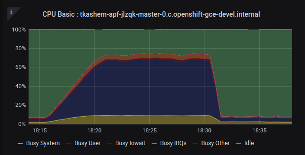
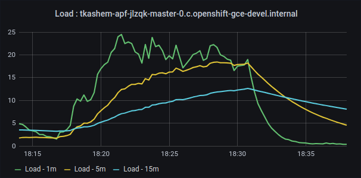
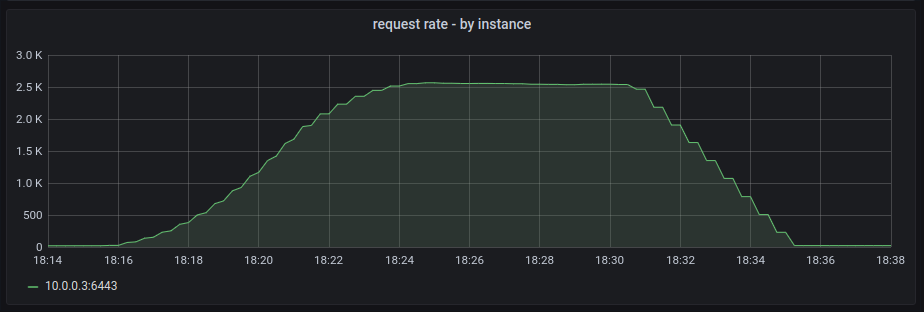
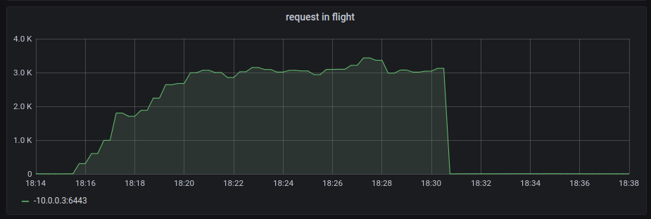

## Objecttive
The goal of this test is to measure the latency request(s) incur in priority and fairness machinery. 
We define this latency as the duration elapsed in `B - A`:
- A: priority and fairness filter starts executing for a request
- B: priority and fairness finishes its processing for the request and starts executing the next filter in the chain.   

We will refer to it as APF latency throughout this document.

## Test Environment:
```
Server Version: 4.6.0-0.ci-2020-09-24-141743
Kubernetes Version: v1.19.0-rc.2.1055+8f59bb6b1d6a92-dirty
```

Cluster:
- Hosted on GCP
- 3-node cluster (3 master nodes, 3 worker nodes)
- The kube API is fronted by an external load balancer.
- The instance type of the master nodes `n1-standard-8`

## Test Setup:
Our goal is to achieve a high number of requests in flight in a real cluster:
- upto 3000 requests in flight.
- A throughput

While we put load on the cluster to achieve the above target, we need to keep in mind:
- The master node(s) should not have any cpu/memory/io resource constraint. Ensure that CPU usage is below 90% on the master nodes.
- Ensure that etcd performance does not suffer.   
 
With these constraints in mind, the test will have the following characteristics:
- `Configmap` create/update/get/delete. 
- etcd database size is not expected to grow with `ConfigMap` churning.
- We choose `Configmap` since this will less likely to trigger any traffic from the control plane components like `kube-controller-manager`, `scheduler` or `kubelet`.
- No `Pod` or `Namespace` churning. (no need to scale up worker nodes)
  
The test runs from a machine external to the cluster and it goes through the external load balancer. The value of `http2-max-streams-per-connection` is `2000`. 
```
apiServerArguments {
  "http2-max-streams-per-connection": [
    "2000"
  ],
}
```
The test is expected to have more than `2000` concurrent requests, and thus there will be more than one tcp connections established. 
A new tcp connection may end up in any of the three master nodes. In order to ensure that all traffic generated from the test end up 
in one `kube-apiserver` instance, we will remove two instances from the load balancer. This will ensure results are comparable
across multiple test runs.

Our goal is to achieve a load of `3000` requests in flight in a small cluster. In order to achieve this I have added a server filter
that adds an artificial delay to request(s) originating from a certain user:
```go
func WithArtificialDelayAdder(handler http.Handler,	userName string, 
    longRunningRequestCheck apirequest.LongRunningRequestCheck,
) http.Handler {
	return http.HandlerFunc(func(w http.ResponseWriter, r *http.Request) {
		user, ok := apirequest.UserFrom(ctx)
		if user.GetName() != userName {
			handler.ServeHTTP(w, r)
			return
		}

		waitTime := wait.Jitter(1 * time.Second, 0.5)
		<-time.After(waitTime)
		handler.ServeHTTP(w, r)	
	})
}
```

To measure how much time a request spends in priority and fairness filter, I have added a decorator time tracks `A` and `B`
and then emits a histogram.
```go
    // before
    return http.HandlerFunc(func(w http.ResponseWriter, r *http.Request) {
		ctx := r.Context()
		r = r.WithContext(WithFiletrStartTimestamp(ctx, time.Now()))

		handler.ServeHTTP(w, r)
	})

    // after
	return http.HandlerFunc(func(w http.ResponseWriter, r *http.Request) {
		// The previous handler started executing this one
		end := time.Now()

		ctx := r.Context()
		start, ok := FilterStartTimestampFrom(ctx)
		if ok {
			metrics.RecordFilterLatency(r, requestInfo, name, end.Sub(start))
		}

		handler.ServeHTTP(w, r)
	})    
```

The above filters are chained as below:
```go
	handler = genericfilters.WithArtificialDelayAdder(handler, "delay-adder", c.LongRunningFunc)

	if c.FlowControl != nil {
		handler = genericfilters.DecorateFilter(handler, "apf", c.LongRunningFunc, func(h http.Handler) http.Handler {
			return genericfilters.WithPriorityAndFairness(h, c.LongRunningFunc, c.FlowControl)
		})
	}
``` 

The stack trace of a request looks like this:
```
...
k8s.io/kubernetes/vendor/k8s.io/apiserver/pkg/endpoints/filters.WithAuthorization.func1:64
k8s.io/kubernetes/vendor/k8s.io/apiserver/pkg/server/filters.WithArtificialDelayAdder.func1:49 (adds ~1s delay)
k8s.io/kubernetes/vendor/k8s.io/apiserver/pkg/server/filters.withDecorateFilterAfter.func1:79 (track B and emit metric)
k8s.io/kubernetes/vendor/k8s.io/apiserver/pkg/server/filters.WithPriorityAndFairness.func2:99
k8s.io/kubernetes/vendor/k8s.io/apiserver/pkg/server/filters.withDecorateFilterBefore.func1:59 (track A)
k8s.io/kubernetes/vendor/k8s.io/apiserver/pkg/endpoints/filters.WithImpersonation.func1:50
...
```

- `WithArtificialDelayAdder` adds `~1s` delay to requests coming from `delay-adder` user.
- `withDecorateFilterBefore` tracks `A`, when APF filter started handling a request.
- `withDecorateFilterAfter` tracks `B`,  when APF filter is finished with a request. 

Finally, set a hig enough value for in flight settings so that the traffic from the test is not throttled by APF. The traffic
from the test is categorized as `flow-schema=global-default` and `priority-level=global-default`
```
apiServerArguments {
  ],
  "max-mutating-requests-inflight": [
    "3000"
  ],
  "max-requests-inflight": [
    "6000"
  ]
}
```


The test runs with the following parameters:
- The test runs as `delay-adder` user: it ensures every request has at least `1s` delay.
- `--concurrency=3000`: The target load is `3000` concurrent requests from the client side.
- `--burst=600` and `--delay=1m`: The load is generated with a step-up approach, 600 go routines at a time and at `1m` interval. 
   This gives `5m` to reach the peak load.
- `--duration=15m`: After the peak load is reached, we stay at steady state for `~10m`.


## Test Results
- Timeline on each snapshot is `28m`

**CPU Usage**

| CPU Usage | Load Average | 
| -------- | -------- | 
|  |  |

- CPU usage is around `70%`. 

  
**Load**

| Throughput | Requests in Flight | 
| -------- | -------- | 
|  |  |
